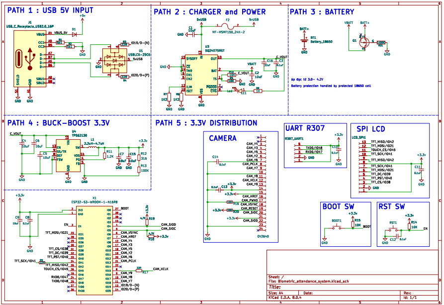
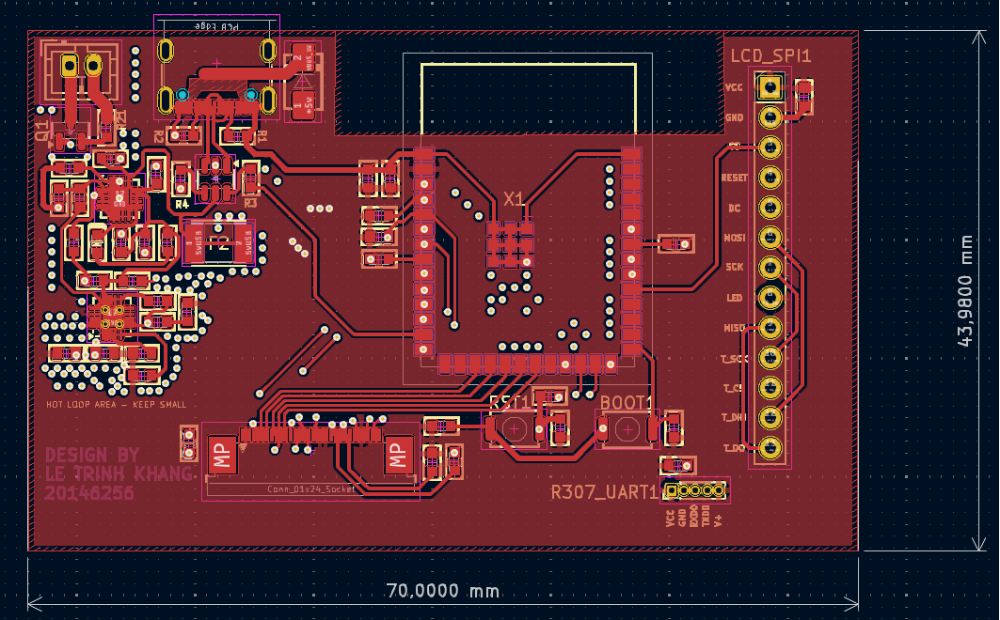
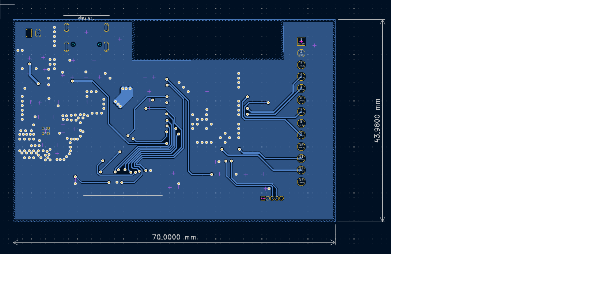
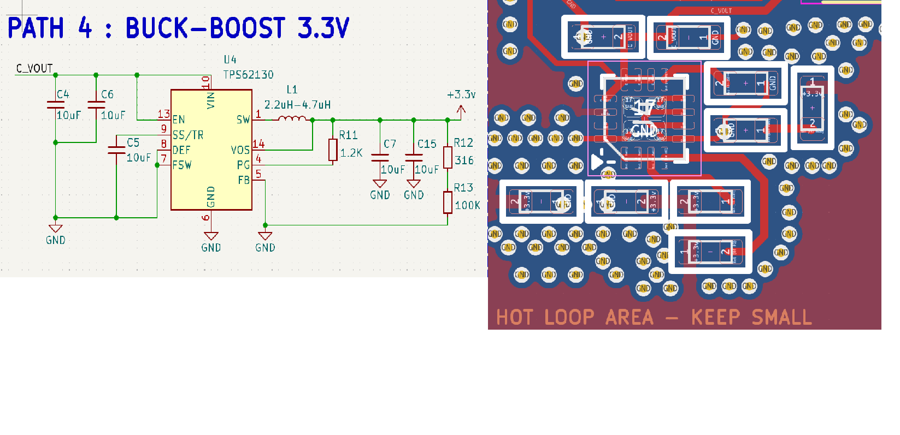
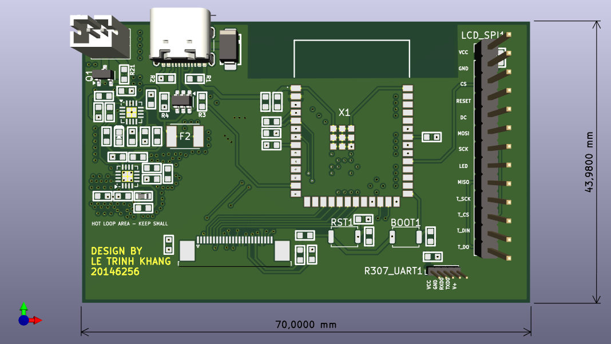
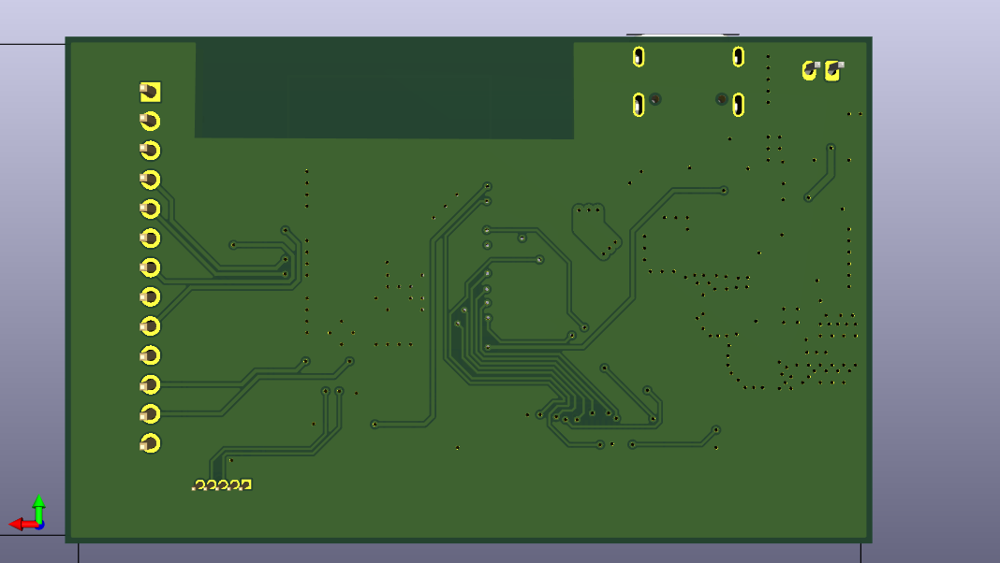

# ESP32-S3 Biometric Attendance – Custom PCB Design

## Project Overview

This project presents a custom 2-layer PCB designed for a biometric attendance device based on ESP32-S3.  
The design integrates power management, high-speed SPI routing, and mixed-signal layout considerations in a compact form factor.

---
# 📄 Schematic Overview

  

---

## 📷 PCB Layout Overview

### Top Copper Layer

  

### Bottom Copper Layer

  

---

## 🔥 Power Stage Layout (Buck Converter Optimization)

### Buck Layout – Hot Loop Minimization

  

The TPS62130 switching regulator layout prioritizes:

- Minimal VIN → SW → Inductor → CIN return loop area  
- Short SW node (~3 mm) to reduce radiated EMI  
- Tight PGND current return  
- Input capacitor placed within millimeters of VIN and PGND pins  

---

## 🧩 3D Board Rendering

### 3D Top View

  

### 3D Bottom View

  

---

## Hardware Specifications

- **Layer Count**: 2-layer FR4  
- **Copper Weight**: 1 oz  
- **Board Size**: 70 × 44 mm  
- **Min Trace/Space**: 0.15 mm  
- **Min Drill**: 0.30 mm  
- **Ground Strategy**: Continuous bottom ground plane  

---

## Power Design

- **Regulator**: Step-down buck converter (3.0–4.2V → 3.3V)  
- **Controller**: TPS62130 (~2.4 MHz switching frequency)  
- **Optimization**:
  - Minimized hot loop area  
  - Proper CIN placement  
  - Thermal vias under IC  
  - Wide 3.3V power rail  

---

## Current & Trace Width Justification

The 3.3V rail supports up to **1.5A load current**, including:

- ESP32-S3 WiFi burst current  
- TFT backlight  
- Fingerprint sensor  
- Safety design margin  

Based on IPC-2221 (1 oz copper, 10°C rise):

- Required trace width ≈ 0.8 mm  
- Implemented trace width = 1.5 mm  

This reduces voltage drop and improves transient stability during high current spikes.

---

## EMI Consideration

Due to high dv/dt and di/dt at the switching node:

- SW trace length minimized (~3 mm)  
- Loop inductance reduced to limit ringing  
- Ground return path kept compact  
- No signal routing under SW node  
- ESP32 antenna keepout strictly respected  

Increasing SW trace length (e.g., 15 mm) would increase loop inductance and radiated EMI.

---

## RF Considerations

- Antenna keepout region respected  
- No copper or ground plane under antenna  
- Controlled ground reference near RF section  

These measures preserve WiFi/BT performance.

---

## Manufacturing

**During DRC validation, the following were corrected:**

- Hole clearance violations resolved  
- Drill size adjusted from 0.2 mm → 0.3 mm  
- Thermal relief optimized  
- Via stitching added for current spreading  
- Final DRC: clean before Gerber generation  

Fully compatible with standard fabrication services (JLCPCB, PCBWay).

---

## Future Improvements

- 4-layer stackup for improved EMI control and return path integrity  
- Further decoupling network optimization  
- Dedicated RF ground stitching zone  
